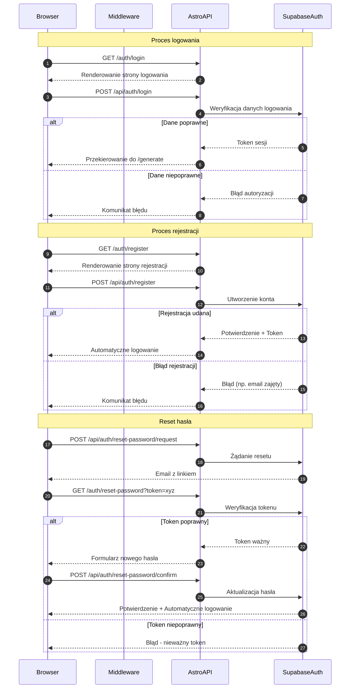

# Diagram przepływu autentykacji

```mermaid
sequenceDiagram
    autonumber
    participant Browser
    participant Middleware
    participant AstroAPI
    participant SupabaseAuth
    
    Note over Browser,SupabaseAuth: Proces logowania
    Browser->>AstroAPI: GET /auth/login
    AstroAPI-->>Browser: Renderowanie strony logowania
    Browser->>AstroAPI: POST /api/auth/login
    AstroAPI->>SupabaseAuth: Weryfikacja danych logowania
    alt Dane poprawne
        SupabaseAuth-->>AstroAPI: Token sesji
        AstroAPI-->>Browser: Przekierowanie do /generate
    else Dane niepoprawne
        SupabaseAuth-->>AstroAPI: Błąd autoryzacji
        AstroAPI-->>Browser: Komunikat błędu
    end

    Note over Browser,SupabaseAuth: Proces rejestracji
    Browser->>AstroAPI: GET /auth/register
    AstroAPI-->>Browser: Renderowanie strony rejestracji
    Browser->>AstroAPI: POST /api/auth/register
    AstroAPI->>SupabaseAuth: Utworzenie konta
    alt Rejestracja udana
        SupabaseAuth-->>AstroAPI: Potwierdzenie + Token
        AstroAPI-->>Browser: Automatyczne logowanie
    else Błąd rejestracji
        SupabaseAuth-->>AstroAPI: Błąd (np. email zajęty)
        AstroAPI-->>Browser: Komunikat błędu
    end

    Note over Browser,SupabaseAuth: Reset hasła
    Browser->>AstroAPI: POST /api/auth/reset-password/request
    AstroAPI->>SupabaseAuth: Żądanie resetu
    SupabaseAuth-->>Browser: Email z linkiem
    Browser->>AstroAPI: GET /auth/reset-password?token=xyz
    AstroAPI->>SupabaseAuth: Weryfikacja tokenu
    alt Token poprawny
        SupabaseAuth-->>AstroAPI: Token ważny
        AstroAPI-->>Browser: Formularz nowego hasła
        Browser->>AstroAPI: POST /api/auth/reset-password/confirm
        AstroAPI->>SupabaseAuth: Aktualizacja hasła
        SupabaseAuth-->>Browser: Potwierdzenie + Automatyczne logowanie
    else Token niepoprawny
        SupabaseAuth-->>Browser: Błąd - nieważny token
    end
``` 