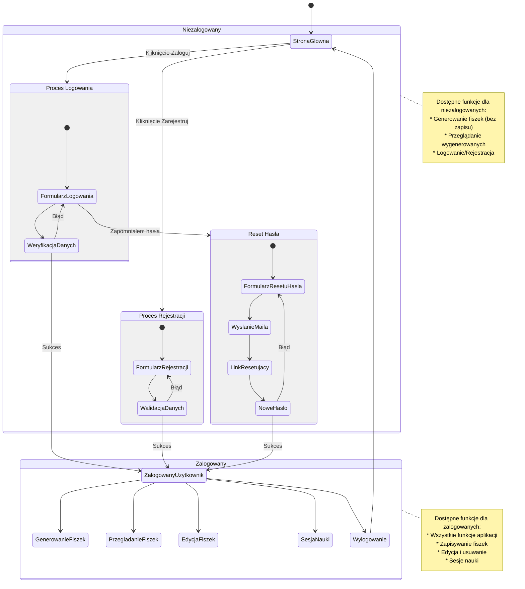

# Diagram podróży użytkownika

```mermaid
stateDiagram-v2
    [*] --> StronaGlowna
    
    state "Niezalogowany" as Guest {
        StronaGlowna --> Logowanie: Kliknięcie Zaloguj
        StronaGlowna --> Rejestracja: Kliknięcie Zarejestruj
        
        state "Proces Logowania" as Logowanie {
            [*] --> FormularzLogowania
            FormularzLogowania --> WeryfikacjaDanych
            WeryfikacjaDanych --> ZalogowanyUzytkownik: Sukces
            WeryfikacjaDanych --> FormularzLogowania: Błąd
            FormularzLogowania --> ResetHasla: Zapomniałem hasła
        }
        
        state "Proces Rejestracji" as Rejestracja {
            [*] --> FormularzRejestracji
            FormularzRejestracji --> WalidacjaDanych
            WalidacjaDanych --> ZalogowanyUzytkownik: Sukces
            WalidacjaDanych --> FormularzRejestracji: Błąd
        }
        
        state "Reset Hasła" as ResetHasla {
            [*] --> FormularzResetuHasla
            FormularzResetuHasla --> WyslanieMaila
            WyslanieMaila --> LinkResetujacy
            LinkResetujacy --> NoweHaslo
            NoweHaslo --> ZalogowanyUzytkownik: Sukces
            NoweHaslo --> FormularzResetuHasla: Błąd
        }
    }
    
    state "Zalogowany" as Auth {
        ZalogowanyUzytkownik --> GenerowanieFiszek
        ZalogowanyUzytkownik --> PrzegladanieFiszek
        ZalogowanyUzytkownik --> EdycjaFiszek
        ZalogowanyUzytkownik --> SesjaNauki
        ZalogowanyUzytkownik --> Wylogowanie
    }
    
    Wylogowanie --> StronaGlowna
    
    note right of Guest
        Dostępne funkcje dla niezalogowanych:
        * Generowanie fiszek (bez zapisu)
        * Przeglądanie wygenerowanych
        * Logowanie/Rejestracja
    end note
    
    note right of Auth
        Dostępne funkcje dla zalogowanych:
        * Wszystkie funkcje aplikacji
        * Zapisywanie fiszek
        * Edycja i usuwanie
        * Sesje nauki
    end note
``` 