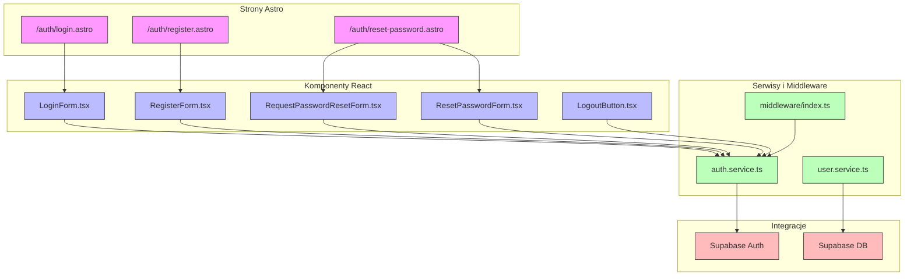

# Diagram komponentów UI

```mermaid
flowchart TD
    subgraph "Strony Astro"
        Login["/auth/login.astro"]
        Register["/auth/register.astro"]
        ResetPwd["/auth/reset-password.astro"]
    end

    subgraph "Komponenty React"
        LoginForm["LoginForm.tsx"]
        RegisterForm["RegisterForm.tsx"]
        ResetReqForm["RequestPasswordResetForm.tsx"]
        ResetConfirmForm["ResetPasswordForm.tsx"]
        LogoutBtn["LogoutButton.tsx"]
    end

    subgraph "Serwisy i Middleware"
        AuthService["auth.service.ts"]
        UserService["user.service.ts"]
        AuthMiddleware["middleware/index.ts"]
    end

    subgraph "Integracje"
        Supabase["Supabase Auth"]
        Database["Supabase DB"]
    end

    Login --> LoginForm
    Register --> RegisterForm
    ResetPwd --> ResetReqForm
    ResetPwd --> ResetConfirmForm

    LoginForm --> AuthService
    RegisterForm --> AuthService
    ResetReqForm --> AuthService
    ResetConfirmForm --> AuthService
    LogoutBtn --> AuthService

    AuthService --> Supabase
    UserService --> Database
    AuthMiddleware --> AuthService

    style Login fill:#f9f,stroke:#333
    style Register fill:#f9f,stroke:#333
    style ResetPwd fill:#f9f,stroke:#333
    style LoginForm fill:#bbf,stroke:#333
    style RegisterForm fill:#bbf,stroke:#333
    style ResetReqForm fill:#bbf,stroke:#333
    style ResetConfirmForm fill:#bbf,stroke:#333
    style LogoutBtn fill:#bbf,stroke:#333
    style AuthService fill:#bfb,stroke:#333
    style UserService fill:#bfb,stroke:#333
    style AuthMiddleware fill:#bfb,stroke:#333
    style Supabase fill:#fbb,stroke:#333
    style Database fill:#fbb,stroke:#333
``` 